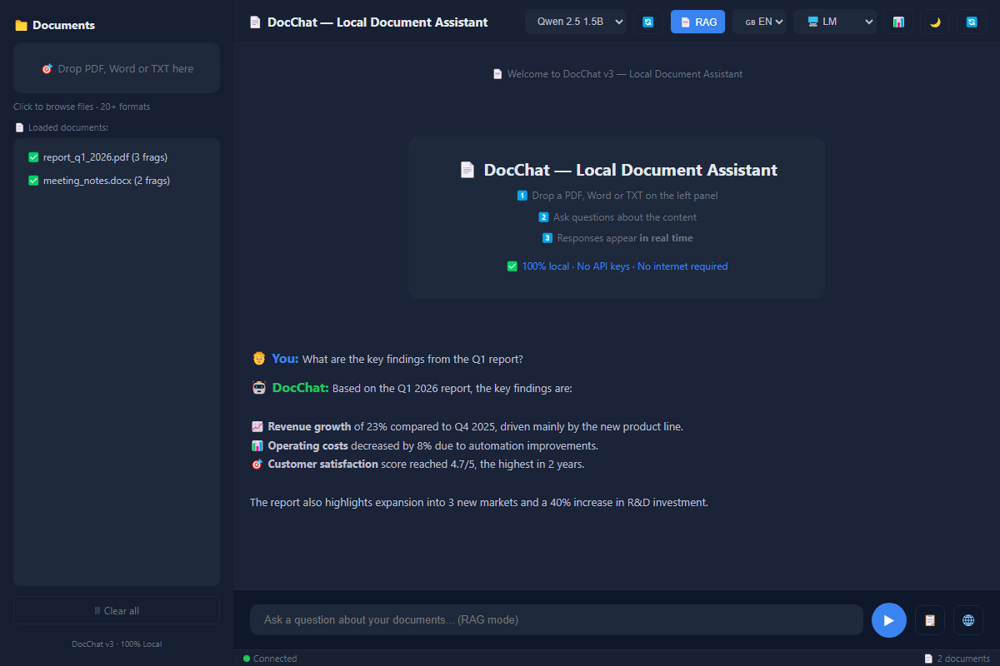
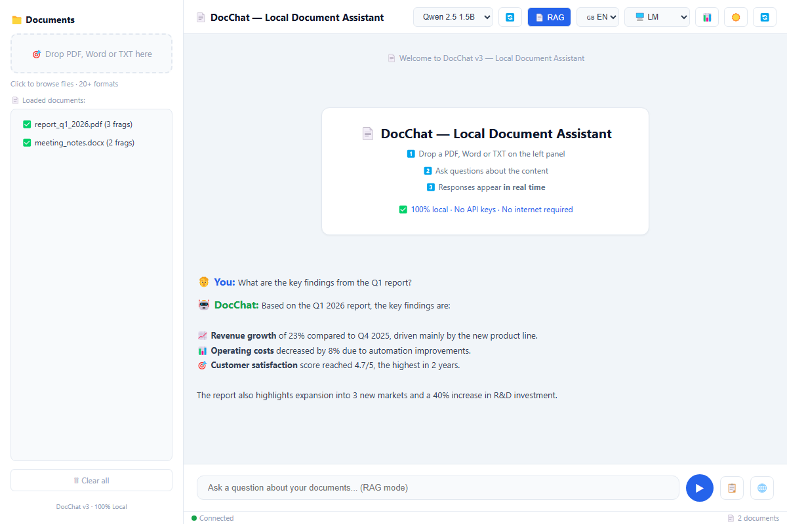

# 📄 DocChat v3 — Local AI Document Assistant

**Chat with your documents — 100% local, private, no API keys required.**

<p align="center">
  
  
  
  
  
  
  
  
  
</p>

[](https://github.com/alcatrading84/DocChat-V3/releases/latest)

---

<p align="center">
  
  <br>
  <em>DocChat v3 — Dark theme · RAG mode · Real-time AI responses</em>
</p>

<p align="center">
  
  <br>
  <em>DocChat v3 — Light theme · Bilingual interface (EN/ES)</em>
</p>

---

## 🏆 Why DocChat?

DocChat is a **production-ready** AI document assistant built from scratch. It demonstrates proficiency in:

| Skill | Demonstrated by |
|-------|----------------|
| **Python Architecture** | Clean modular design (engine, UI, API, OCR, metrics, updater) |
| **AI/ML Integration** | RAG pipeline, embeddings, vector search, 3 LLM backends |
| **Desktop Development** | Native PyQt6 GUI with custom theming, drag & drop, threading |
| **Web Development** | Flask REST API with real-time SSE streaming |
| **OCR & Document Processing** | 20+ file formats, Tesseract OCR for scanned PDFs |
| **Software Packaging** | PyInstaller distribution, auto-updater, versioning |
| **Bilingual UX** | Full English/Spanish internationalization |

---

## 🛠️ Tech Stack

| Category | Technologies |
|----------|-------------|
| **Language** | Python 3.10+ |
| **Desktop UI** | PyQt6 (QThread, QTimer, custom QSS styling) |
| **Web UI** | Flask (REST API, SSE streaming, event-driven) |
| **AI / LLM** | llama-cpp-python (local GGUF), LM Studio API, OpenAI API |
| **RAG Pipeline** | Custom vector store, cosine similarity, embeddings, chunking |
| **Document Processing** | pypdf, python-docx, python-pptx, openpyxl, pytesseract |
| **Networking** | httpx (async HTTP), threading |
| **DevOps** | PyInstaller, Git, GitHub Actions-ready |
| **Data** | JSON persistence, NumPy (vector math) |
| **UX** | Drag & drop, real-time streaming, dark/light theme, ES/EN i18n |

---

## 🚀 Quick Start

### Option A: Download (Recommended)
```bash
# 1. Download DocChat.exe from Releases
# 2. Double-click to run
# 3. Model auto-downloads on first launch (~1GB)
```

### Option B: From Source
```bash
git clone https://github.com/alcatrading84/DocChat-V3.git
cd DocChat-V3
pip install -r requirements.txt
python run.py
```

---

## 🧠 AI Modes

DocChat supports **3 inference backends** switchable from the UI:

| Mode | Backend | Best for |
|------|---------|----------|
| 🖥️ **LM Studio** | Local API (127.0.0.1:1234) | Large models, higher quality |
| ☁️ **OpenAI Cloud** | GPT-4o-mini API | Maximum accuracy |
| 🏠 **GGUF Local** | llama-cpp-python (built-in) | **No dependencies, fully offline** |

### Built-in GGUF Models (auto-download)

| Model | Size | RAM Required |
|-------|------|-------------|
| Qwen 2.5 1.5B (default) | ~1 GB | 4 GB |
| Qwen 2.5 0.5B (light) | ~350 MB | 2 GB |
| Llama 3.2 1B (alt) | ~700 MB | 4 GB |

---

## 📁 Supported Formats (20+)

`PDF` · `DOCX` · `TXT` · `MD` · `HTML` · `CSV` · `XLSX` · `PPTX` · `JSON` · `XML` · `YAML` · `PY` · `JS` · `TS` · `JAVA` · `CPP` · `C` · `GO` · `RS` · `RB` · `PHP` · `SWIFT` · `KT` · `SQL` · `SH` · `BAT` · `PS1` · `R`

> **OCR for scanned PDFs** — Automatic Tesseract OCR fallback when text is not selectable.

---

## ⚡ Key Features

| Feature | Description |
|---------|-------------|
| **RAG Search** | Semantic document search with configurable chunking |
| **Real-time Streaming** | Token-by-token responses (SSE in Web UI) |
| **Embedding Cache** | LRU cache avoids re-embedding repeated queries |
| **Summarize** | One-click document summary generation |
| **Translate** | Translate responses between English/Spanish |
| **Export** | Save full conversation to TXT |
| **Theme** | Dark/Light mode toggle |
| **Auto-Updater** | Checks GitHub for new versions |
| **Metrics** | Usage statistics and reports |
| **Bilingual UI** | Full Spanish/English interface |

---

## 📂 Project Architecture

```
DocChat/
├── run.py                 # 🚀 CLI entry point
├── requirements.txt       # Dependencies
├── DocChat.spec           # PyInstaller build config
├── README.md              # Documentation (EN)
├── README.es.md           # Documentation (ES)
├── favicon.ico            # App icon
├── docchat/
│   ├── config.py          # ⚙️ Centralized configuration
│   ├── version.py         # 📌 Version management
│   ├── engine.py          # 🏆 RAG engine (core)
│   ├── local_model.py     # 🧠 Local GGUF inference
│   ├── ui.py              # 🖥️ PyQt6 desktop UI
│   ├── web_ui.py          # 🌐 Flask web UI
│   ├── ocr.py             # 👁️ Tesseract OCR
│   ├── formats.py         # 📊 Multi-format loader
│   ├── metrics.py         # 📈 Usage metrics
│   ├── updater.py         # 🔄 Auto-updater
│   └── lang.py            # 🌍 ES/EN translations
├── docchat/
│   └── Guia_DocChat_v3.pdf # 📄 User guide (ES)
└── dist/
    └── DocChat.exe        # 📦 Portable executable
```

---

## 🎯 Architecture Highlights

### Clean Modular Design
Each module has a **single responsibility**:
- `engine.py` → RAG pipeline + AI clients
- `ui.py` → Desktop GUI (no business logic)
- `web_ui.py` → Web server (same engine)
- `formats.py` → Document parsing (20+ formats)
- `ocr.py` → Image text extraction
- `config.py` → All constants in one place

### Dual UI Architecture
Both **PyQt6 desktop** and **Flask web** interfaces share the same `DocChatEngine`, ensuring feature parity and maintainability.

### Production-Grade Features
- Global exception handling with user-friendly messages
- Dependency verification at startup
- Thread-safe workers with progress signals
- Persistent metrics collection
- Automatic model downloading
- Version checking and updates

---

## 💻 Requirements

| Component | Minimum | Recommended |
|-----------|---------|-------------|
| RAM | 4 GB | 8 GB |
| Storage | 1 GB free | 2 GB free |
| OS | Windows 10+ / Linux / macOS | - |
| Python | 3.10+ (source only) | - |

**Optional:** Tesseract OCR (for scanned PDFs), LM Studio (for cloud mode)

---

## 📄 License

MIT — Free to use, modify, and distribute.

---

<p align="center">
  <a href="https://github.com/alcatrading84/DocChat-V3">
    
  </a>
  <a href="https://github.com/alcatrading84/DocChat-V3/releases/latest">
    
  </a>
</p>
